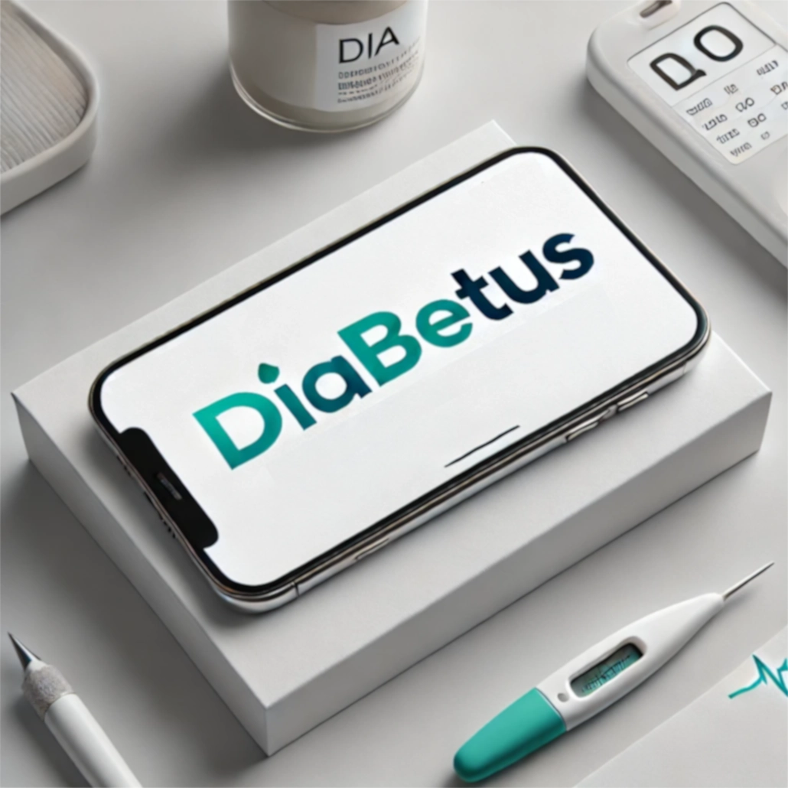

DIABETUS

<div align="center">
  
  <h3>"So easy my Dad can use it!"</h3>
</div>

> **IMPORTANT**: This app supports diabetes management but should not replace professional medical advice. Always consult healthcare providers before making changes to your diabetes management routine.

[](https://nx.dev)
[](https://nextjs.org)
[](https://expressjs.com)
[](https://www.typescriptlang.org)
[](https://tailwindcss.com)
[](https://storybook.js.org)

<a href="https://www.libreview.com/"></a>
<a href="https://www.apple.com/ios/health/"></a>

## What is Diabetus?

Diabetus is a parent-friendly diabetes management application designed with simplicity in mind. It helps you monitor, understand, and manage diabetes by turning complex glucose data into clear, actionable insights.

## Features ✨

### Core Features

- 📊 **Real-Time Monitoring** - Automatic sync with Libre device and instant access to glucose levels
- 📈 **Visual Analysis & Insights** - Advanced pattern recognition and predictive glucose trend modeling
- 🍎 **Smart Management Tools** - Carbohydrate tracking, meal timing recommendations, and treatment history
- 📱 **Family-Friendly Experience** - Simple, intuitive interface with clear visualizations

### Technical Features

- 🏗️ **NX Monorepo Structure** - Efficient workspace organization for optimal code sharing
- ⚡ **Next.js Frontend** - Server-side rendered React application with modern UI
- 🔐 **Express Gateway** - Dynamic API gateway for LibreView integration
- 📦 **Modular APIs** - Self-contained API libraries for glucose data management
- 🎨 **Modern Styling** - Responsive and accessible designs using TailwindCSS
- 🧪 **Full Test Suite** - Comprehensive testing with Jest and Cypress
- 🔄 **Continuous Integration** - Automated testing and deployment pipeline
- 📚 **Storybook** - Interactive component development and documentation

## Understanding Diabetes

Diabetes affects how our body processes glucose (blood sugar), our main source of energy. The app helps monitor and manage:

- **Insulin** production and effectiveness
- **Blood glucose levels** after meals
- **Physical activity** impact
- **Stress** and **hormonal** effects
- **Sleep** and daily routine impacts

### Understanding the Glucose Lag

<div align="center">
  
</div>

When using continuous glucose monitoring (CGM) systems like the FreeStyle Libre, readings have a natural 10-15 minute lag as they measure interstitial fluid glucose rather than blood glucose.

Think of it like a race between a hare (blood glucose) and a tortoise (interstitial fluid):

- Blood glucose levels change rapidly after eating or insulin
- Interstitial fluid glucose follows the same pattern, but 10-15 minutes behind
- This lag is completely normal and expected
- The gap can be wider during rapid glucose changes

### True Source of Truth: Manual Blood Levels

Diabetus bridges the gap between interstitial glucose readings and finger-prick tests. With this feature, users can:

- Input manual blood glucose readings
- Compare interstitial and blood glucose side by side
- Spot patterns and discrepancies
- Establish a "true source of truth" for confidence in management

## Technical Integration

### LibreView Integration

Diabetus leverages the unofficial LibreView API to provide:

- Continuous glucose monitoring data
- Historical data analysis
- Trend detection
- Real-time alerts
- Pattern recognition

### Project Structure 📁

```
diabetus/
├── apps/
│   ├── diabetus/        # @diabetus/source - Next.js frontend application
│   ├── diabetus-e2e/    # Frontend end-to-end tests
│   ├── api-gateway/     # ApiGateway - LibreView integration and routing
│   └── api-gateway-e2e/ # API gateway end-to-end tests
├── libs/
│   ├── data-access/
│   │   └── libre/       # @diabetus/data-access/libre - LibreView API integration
│   │       ├── src/
│   │       │   ├── lib/
│   │       │   │   ├── types.ts        # LibreView API types
│   │       │   │   ├── routes.ts       # API route definitions
���   │       │   │   └── libre.service.ts # LibreView service implementation
│   │       │   └── index.ts
│   └── ui/             # @diabetus/ui - Shared UI components
│       └── components/ # React components with Storybook documentation
```

### Getting Started 🚀

1. Clone this repository
   ```bash
   git clone https://github.com/yourusername/diabetus.git
   cd diabetus
   ```
2. Install dependencies:
   ```bash
   make install
   ```
3. Configure environment:
   - Copy `.env.example` to `.env`
   - Add your LibreView API credentials
4. Start development:
   ```bash
   make dev
   ```

For all available commands, run `make help`.

### Development Data 🧪

During development, you can use Vital API's Synthetic Data to test and develop features without requiring live user data. This ensures a consistent development experience and helps with testing edge cases.

#### Synthetic Data Features:

- Pre-generated realistic glucose patterns
- Simulated meal and activity impacts
- Various diabetes scenarios and patterns
- Consistent test data across development

> **Note**: While Vital API integration is planned for future releases, the synthetic data feature will be available to help developers test and build features without requiring real user data. Learn more about Vital's test data at their [official documentation](https://docs.tryvital.io/wearables/providers/test_data).

### Development Commands 🛠️

```bash
Development Commands:
make install    - Install all dependencies
make clean      - Clean build artifacts
make dev        - Start development servers
make test       - Run all tests
make lint       - Run linting
make build      - Build all applications
make serve-all  - Serve all applications
make e2e        - Run end-to-end tests
make testsuite  - Run all test jobs
make storybook  - Start Storybook server
```

### Import Rules 📦

1. **Frontend App** (`apps/diabetus/`):

   ```typescript
   import { ComponentName } from '@diabetus/ui';
   import { LibreService } from '@diabetus/data-access/libre';
   ```

2. **API Gateway** (`apps/api-gateway/`):

   ```typescript
   import { libreRoutes } from '@diabetus/data-access/libre';
   ```

3. **UI Library** (`libs/ui/components/`):

   ```typescript
   import { Component } from './lib/component-name';
   ```

4. **LibreView Integration** (`libs/data-access/libre/`):
   ```typescript
   import { LibreViewTypes } from './lib/types';
   import { LibreService } from './lib/libre.service';
   ```

## Resources & Documentation

- [Official LibreView Platform](https://www.libreview.com/)
- [Unofficial LibreView API Documentation](https://libreview-unofficial.stoplight.io/)
- [NX Documentation](https://nx.dev/getting-started/intro)
- [Next.js Documentation](https://nextjs.org/docs)

> **Developer Note**: The API Gateway architecture ensures secure and efficient access to LibreView data while providing a foundation for future service integrations.
